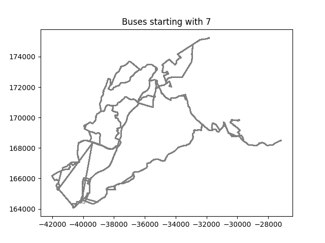

# Bus Routes Analysis Project

This project looks at possible connections between bus routes that start with the same number. It uses geographic and transportation data from **STCP (Sociedade de Transportes Coletivos do Porto)**. While no clear patterns were found, the project shows how to work with spatial data and create visualizations.

## Technologies Used

- **PostgreSQL** with **PostGIS** for managing spatial data.
- **Python** for processing data and making visualizations (`pandas`, `matplotlib`, `psycopg2`).
- **STCP Dataset** downloaded from the official website.

## Key Insights

- Bus routes were grouped by their starting number to look for geographic patterns.
- Visualizations showed how routes are distributed, but no significant relationships were found.

## Example Plot

This plot shows bus routes, for routes starting with the same number.
